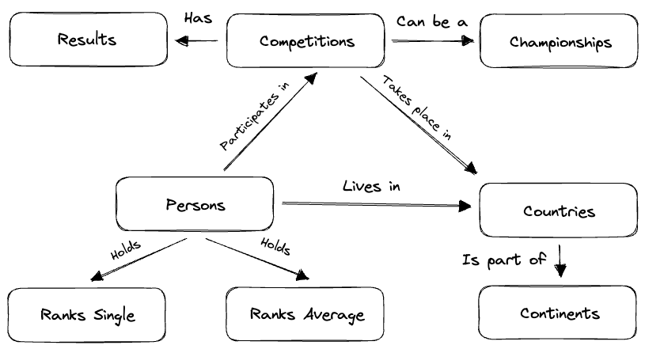

<h1 align="center">Unofficial World Cube Association (WCA) Public API</h1>

<p align="center">
    
</p>

<p align="center">
<a href="https://github.com/robiningelbrecht/wca-rest-api/blob/master/.github/workflows/ci.yml"></a>
<a href="https://github.com/robiningelbrecht/wca-rest-api/blob/master/LICENSE"></a>
<a href="https://phpstan.org/"></a>
</p>

---

Welcome to the **unofficial** [World Cube Association](https://worldcubeassociation.org) (WCA) Public API documentation! 
Here, you'll find all the information you need to integrate this API seamlessly into your projects. 
Access competition data, results, competitor profiles, rankings, and more.

**Note**: This API is served through static JSON files on *GitHub*, which means the structure of the endpoints has limitations. 
The reason for doing so is:

* The data doesn't change that much, max once a day
* Static file-based API is (or should be) very fast
* I don't want to pay for any hosting because it could get very expensive, very fast

The API is updated once a day so rankings and results are not real-time.

> This information is based on competition results owned and maintained by the
> World Cube Association, published at https://www.worldcubeassociation.org/export/results
> as of <!--START_SECTION:version-date-->May 15, 2026<!--END_SECTION:version-date-->.

I'm in no way affiliated with or part of the official WCA software team.

## Getting started

The full documentation and specs are available at
[https://wca-rest-api.robiningelbrecht.be/](https://wca-rest-api.robiningelbrecht.be/)

## Feedback

For any feature requests, help posts, or bug reports, please [open an issue](https://github.com/robiningelbrecht/wca-rest-api/issues/new) in the issue queue. I'll be happy to help you out.

## Entity relations

To give you an idea about the relations between the entities and how you can query the API,
I created the following schema:

<p align="center">
    
</p>

## Local development

If you'd like to help with the development of this project, or you just want to run it locally,
run the following commands:

```bash
# Clone repo
> git clone git@github.com:robiningelbrecht/wca-rest-api.git
# Setup .env file
> cp .env.dist .env
# Build docker containers
> docker-compose up -d --build
# Install dependencies
> docker-compose run --rm php-cli composer install
# Build all the static API files.
> docker-compose run --rm php-cli bin/build-new-api.sh "continent,country,event,competition,championship,person,rank,result,version"
```

This should result in following CLI output:

```text
Downloading WCA export...
Unzipping WCA export...
Archive:  wca-export/export.zip
  inflating: wca-export/metadata.json  
  inflating: wca-export/README.md    
  inflating: wca-export/WCA_export.sql  
Importing WCA export to database...
Building API...
  - Building continent API...
  100% [============================] 2/2 [< 1 sec]
  - Building country API...
  100% [============================] 2/2 [< 1 sec]
  - Building event API...
  100% [============================] 2/2 [< 1 sec]
  - Building competition API...
  100% [============================] 12487/12487 [1 min]
  - Building championship API...
  100% [============================] 582/582 [7 secs]
  - Building person API...
  100% [============================] 199304/199304 [51 mins]
  - Building rank API...
  100% [============================] 43/43  [24 mins]
  - Building result API...
  100% [============================] 10028/10028 [5 secs]
  - Updating API version...
Total execution time: 77 min
```

### Test suite

When you've completed the local setup, you can run the test suite:

```bash
> docker-compose run --rm php-cli vendor/bin/phpunit
```
